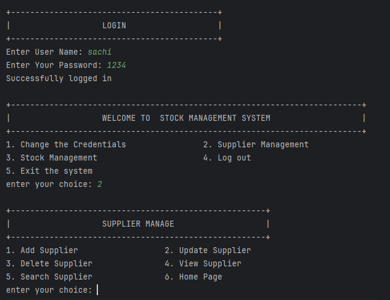

# Stock Management System (Java Console Application)

A simple **Java-based console application** for managing stock, suppliers, categories, and items.  
It allows secure login, user credential management, and basic inventory control.  
Perfect for learning **Java arrays, console I/O, and basic CRUD operations**.

---

## Features

### User Authentication
- Login with username and password.
- Reset and update credentials securely.

### Supplier Management
- Add, update, delete, and search suppliers.
- View all suppliers in a formatted table.

### Category Management
- Add, update, and delete item categories.
- View items grouped by category.

### Item Management
- Add new items with supplier and category details.
- Search items by supplier or category.
- Rank items by unit price.

### Navigation
- Simple menu-driven interface.
- Home page, logout, and exit options.

---

## Screenshot

